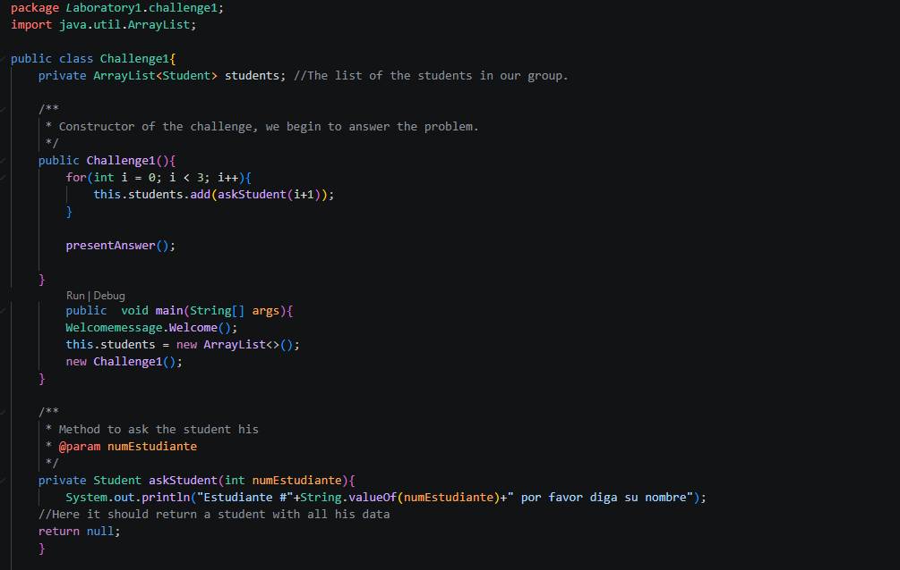

<<<<<<< HEAD
Laboratory 1 — Git, GitHub, and Functional Programming

Team Members
|-----------------------------|-------------------------------------|-----------------|
| Name                        | Institutional Email                 | GitHub Username |
|-----------------------------|-------------------------------------|-----------------|
| Juan José Rivera López      |juan.rivera@escuelaing.edu.co        |Juanjorivlo      |
| Juan Esteban Laverde Mesa   |juan.lmesa@mail.escuelaing.edu.co    | JElaverdem      |
| Brian Steven Fierro Lechuga |brian.fierro-l@mail.escuelaing.edu.co| BrianFierro03   |
|-----------------------------|-------------------------------------|-----------------|

 Challenge Evidence & Technical Explanations

# Challenge 1 — Welcome Message
[Challenge 1 evidence](images/challenge1.png)
Description:
We use 3 different classes, the main class, the student class, and the message class, the student class has the student attributes, We divided between Juan Jose and Juan Esteban, Juan jose implements the welcome class and Juan Esteban the Student class. We use: push, pull, comit, add. We didn't have any conflict with the merge

# Challenge 2 — Parallel Commit Race
[Challenge 2 evidence](images/challenge2.png)
Description:
*   What was implemented: 
*   How the work was divided: 
*   Which Git operations were used: 
*   Which conflicts appeared: 
*   How the conflicts were resolved: 

# Challenge 3 — The Mysterious Echo
[Challenge 3 evidence](images/challenge3.png)
Description:
*   What was implemented: 
*   How the work was divided: 
*   Which Git operations were used: 
*   Which conflicts appeared: 
*   How the conflicts were resolved: 

# Challenge 4 — The Treasure of Duplicate Keys
[Challenge 4 evidence](images/challenge4.png)
Description:
*   What was implemented: 
*   How the work was divided: 
*   Which Git operations were used: 
*   Which conflicts appeared: 
*   How the conflicts were resolved: 

# Challenge 5 — Battle of Sets
[Challenge 5 evidence](images/challenge5.png)
Description:
*   What was implemented: A HashSet and a TreeSet that use lambda functions to filter numbers that we do not want, to get them into order we use the TreeSet and use another lambda function to print the message with the numbers.
*   How the work was divided: Juan Laverde implemented the part of the HashSet, Brian Fierro implemented the TreeSet and the answer to the challenge, printing it.
*   Which Git operations were used: git push, git pull, git commit -m, git merge.
*   Which conflicts appeared: No conflict appeared.
*   How the conflicts were resolved: It was not necessary to resolve a conflict.

# Challenge 6 — The Decision Machine
[Challenge 6 evidence](images/challenge6.png)
Description:
* What was implemented:Lambda functions to print the messages, a map of the class 'Runnable' to better implement the texts of the print, a switch to know and be sure the command was something expected.
* How the work was divided: Juan Esteban created the structure of the challenge and implemented the part of Student A, Brian Steven implemented the part of Student B and the execution of those commands.
* Which Git operations were used: git checkout -b, git commit -m, git push, git merge.
* Which conflicts appeared: When trying to merge the changes to develop, the contents of the README about the challenge 6 dissapeared.
* How the conflicts were resolved: Using the last commit in the branch of the challenge copy what was in the README and talked with the team to know what happened so we can be more careful.

++++++++++++++++++++++++++++++++++++++++++++++++++++++++++++++++++++++++++++++++++++++++++++++++

 Answers to the Conceptual Questionnaire

1. Team agreements:
-We are going to communicate through a group in WhatsApp and have a group in team wich we are going to use to make calls if needed.

2. What is the difference between git merge and git rebase?

3. What happens when two branches modify the same line of a file?

4. How can you display the branch and merge history graphically in the terminal?

5. What is the difference between a commit and a push?
-With a commit we change the 'staging' workplace, where we upload but it can not be seen by others or in GitHub, we use a push to upload the changes made with the commits to the remote workplace wich is GitHub, if we push, it can be seen by others.

6. What are git stash and git stash pop used for?

7. What is the difference between HashMap and Hashtable?

8. What advantages does Collectors.toMap() provide over a traditional loop?

9. When using stream().map() on a list of objects, what type of operation is being performed?

10. What does stream().filter() do, and what does it return?
-It transfoms the iterable collection into an stream with all the things inside it, with filter we can decide wich numbers that fulfill a condition we are going to continue to use. When we perform a stream().filter() it creates a new Stream that contains the numbers that satisfy that condition.

11. Describe the steps required to create a new feature branch from develop.

12. What is the difference between git branch and git checkout -b?
-

13. Why should new functionality be developed in feature/* branches instead of directly in main?
-To have a better workflow and because we only merge into main when we are certain the software is fully working because it is what we are going to deliver to production and we do not want to keep changing a lot a working software located in main
=======
Team Members:

Juan Esteban Laverde Mesa

Juan José Rivera Lopez

Brian Steven Fierro Lechuga

Challenge evidence:

Challenge1:
##Evidence:

##Description:
We use 3 different classes, the main class, the student class, and the message class, the student class has the student attributes, We divided between Juan Jose and Juan Esteban, Juan jose implements the welcome class and Juan Esteban the Student class. We use: push, pull, comit, add. We didn't have any conflict
Challenge2:

Challenge3:

Challenge4:

Challenge5:

Challenge6:

Technical explanations:

Answers:

>>>>>>> 279cd9b73037b2b39136b47e5732130b636fd2a0
